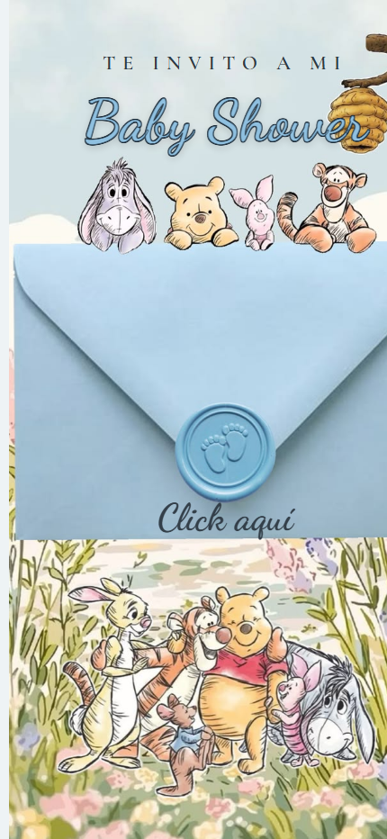
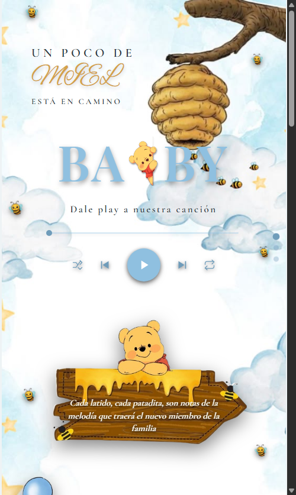
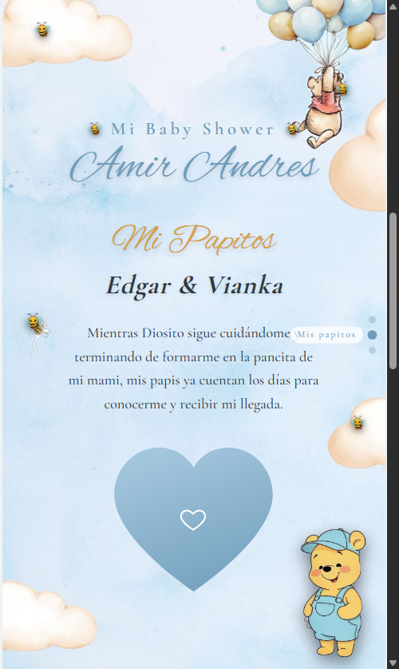
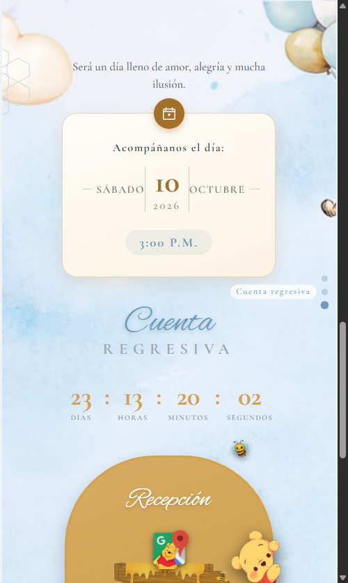

# Baby Shower — Amir Andres

Invitación digital para el Baby Shower de Amir Andrés, con temática de Winnie Pooh. Sitio estático (HTML/CSS/JS puro, sin frameworks) pensado para verse como una tarjeta de celular.

🔗 **Sitio publicado:** [baby-shower-amir.vercel.app](https://baby-shower-amir.vercel.app)

## Capturas

### Portada (clic para entrar)



### Baby en camino



### Mis Papitos



### Cuenta regresiva y Recepción



## Estructura

```
index.html      → Portada (clic para entrar, con transición en espiral)
pagina2.html    → Documento único y escroleable con todas las secciones:
                    - Baby en camino (título + reproductor + versículo)
                    - Mis Papitos (padres + nombre del bebé + foto)
                    - Cuenta regresiva (fecha, contador, recepción, confirmar asistencia)
css/            → Un archivo de estilos por sección
js/             → Reproductor, contador regresivo y navegación por secciones
img/            → Ilustraciones e imágenes recortadas
mp3/            → Canción de fondo
```

## Cómo editar

No requiere build ni instalación: son archivos estáticos. Basta con abrir `index.html` en el navegador para probar los cambios localmente, y subir a GitHub para que se despliegue solo en Vercel.

## Pendientes

- [ ] Agregar el link de Google Maps en el botón "Ver ubicación" (Recepción).
- [ ] Subir la foto de los papás como `img/pareja.jpg` para que reemplace el placeholder del corazón.
